# GlassFit CV Microservice - Inference Pipeline

**Service:** FastAPI 0.111 + Uvicorn, Python 3.11  
**Entry point:** `POST /analyze-image`  
**Audience:** Machine learning engineers and academic reviewers  

---

## Pipeline Overview

The pipeline converts a single JPEG/PNG room photo into a structured scene representation used by the Three.js visualization engine. It runs **three independent ML models in sequence**, with classical computer vision filling gaps where models are unavailable.

```mermaid
flowchart TD
    A["Client Upload\nJPEG / PNG, max 12 MB"] --> B

    subgraph PRE["Pre-processing"]
        B["EXIF Extraction\nPillow ExifTags\nFocalLength · FocalLengthIn35mmFilm · Model"]
        B --> C["Orientation Correction\nPillow ImageOps.exif_transpose\nApplies EXIF rotation tag in-place"]
        C --> D["Luminance and Lighting Analysis\nOpenCV BGR to Grayscale, HSV, CIE L*a*b*\nMean intensity · Contrast sigma · Saturation\nAmbient RGB (20th-80th percentile lightness band)\nWarmth · Tint · Sharpness (Laplacian variance)\nNoise (Sobel-masked flat-region residual sigma)\nLight direction (quadrant luminance gradient)"]
    end

    D --> E

    subgraph SEG["Stage 1 - Instance Segmentation"]
        E["YOLOv8s-seg\nUltralytics · COCO-80 vocab\nInput size: 1024 px · conf >= 0.35 · IoU 0.50\nretina_masks=True (full-resolution masks)\nFiltered to 22 interior-relevant classes\nSofa, chair, table, bed, person, etc."]
        E --> F["Post-processing\nBbox clamping · Area filter (min 1.8% image area)\nNMS IoU dedup (threshold 0.72)\nLabel aliasing: couch to sofa, dining table to table\nRank score = conf + area_ratio x 2.5 + furniture_bonus\nTop-N kept (default N=5)\nMasks saved as RGBA PNG (binary, 0 or 255)"]
    end

    D --> G

    subgraph DEPTH["Stage 2 - Monocular Depth Estimation"]
        G["Depth Anything V2 Small\nHuggingFace Transformers pipeline\ndepth-anything/Depth-Anything-V2-Small-hf\nDPT architecture · ViT-S backbone\nInput: PIL RGB image\nOutput: relative disparity map (float32)"]
        G --> H["Normalization\nLinear rescale to 0-255 uint8\nBilinear resize to match original image resolution\nSaved as 8-bit grayscale PNG\nRaw float array passed internally for scene and scale stages"]
    end

    F --> I
    H --> I

    subgraph SCENE["Stage 3 - Semantic Scene Segmentation"]
        I["SegFormer-B0\nnvidia/segformer-b0-finetuned-ade-512-512\nHuggingFace Transformers\nMix Transformer MiT-B0 encoder\nLightweight all-MLP decode head\nADE20K-150 class vocabulary"]
        I --> J["Logit Upsampling\ntorch.nn.functional.interpolate\nBilinear · align_corners=False\nRestored to original H x W"]
        J --> K["Class Extraction\nArgmax over 150 classes\nFloor: ADE20K class 3\nWall: ADE20K class 0\nBinary masks to RGBA PNG\nNormalized boundary coords: floor_top_y, wall_left_x, wall_right_x"]
    end

    subgraph FALLBACK["Stage 3 Fallback - Depth Plane Fitting"]
        L["Classical Heuristic - No additional model\nRow-wise mean depth gradient (bottom 65% of image)\nUpward scan: 5-row sliding window\nFloor-wall boundary at gradient collapse < 0.004\nFallback estimate: floor_top_y = 0.60"]
    end

    K -->|"SegFormer available"| M
    K -->|"SegFormer fails"| L
    L --> M

    subgraph REMAP["Coordinate Remapping"]
        M["Workspace Normalization\nPillow LANCZOS resize to max 1920px long edge\nSaved as WebP (quality 90, method 6)\nAll masks bilinearly resized to workspace dims\nAll bboxes rescaled by workspace_w / original_w"]
    end

    F --> N
    H --> N
    M --> N

    subgraph SCALE["Scale Estimation"]
        N["Anchor-Based Scale (cm per px)\nReference heights: person 163 cm, fridge 165 cm,\ntable 75 cm, chair 90 cm, sofa 85 cm, etc.\nscale = ref_height_cm / bbox_height_px\nDepth correction: 5x5 patch mean at bbox center\nfrom Depth Anything V2 normalized float array\nFinal: confidence-weighted average across all anchors\nMethod: yolo_anchor or yolo_anchor_depth_corrected\nEXIF focal length appended for downstream use"]
    end

    N --> O["JSON Response\nsession_id · workspace_image url, width, height\nbrightness · lighting ambient_hex, warmth, direction, suggested adjustments\nobjects[] id, label, conf, bbox, mask_url\nsegmentation mode, model\ndepth depth_map_url, mode\nscene floor/wall mask urls, coverage percent, boundary coords\nscale_estimation best_scale_cm_per_px, confidence, anchors, EXIF"]
```

---

## Model Registry

| Stage | Model | Architecture | Weights | Vocab | Library |
|---|---|---|---|---|---|
| Instance Segmentation | YOLOv8s-seg | CSPDarknet53 + C2f + Mask head | `yolov8s-seg.pt` (~23 MB) | COCO-80 (filtered to 22) | Ultralytics |
| Monocular Depth | Depth Anything V2 Small | DPT + ViT-S/14 backbone | HF Hub ~99 MB | N/A (regression) | HuggingFace Transformers |
| Semantic Segmentation | SegFormer-B0 | Mix Transformer + All-MLP decoder | HF Hub ~14 MB | ADE20K-150 | HuggingFace Transformers |

---

## Inference Order and Data Dependencies

The three models run **sequentially**, not in parallel, because downstream stages consume outputs from upstream ones:

| Stage | Produces | Consumed By |
|---|---|---|
| YOLOv8s-seg | `objects[]` with bboxes and binary masks | Scale Estimation (anchor bboxes) |
| Depth Anything V2 | `depth_array_normalized` (float32 H x W) | Scene Detection (fallback), Scale Estimation (depth correction) |
| SegFormer-B0 | `floor_mask`, `wall_mask`, boundary coords | Workspace remapping, Three.js overlay snapping |

---

## Classical CV Components (No ML Model)

| Component | Technique | Library |
|---|---|---|
| EXIF orientation fix | `ImageOps.exif_transpose` (EXIF tag 274) | Pillow |
| EXIF camera intrinsics | Tags 37386 (FocalLength), 41989 (35mm equiv), 272 (Model) | Pillow ExifTags |
| Brightness analysis | BGR to grayscale, `np.mean` of pixel intensities | OpenCV, NumPy |
| Lighting analysis | BGR to HSV, CIE L*a*b*; Laplacian variance (sharpness); Sobel-masked residual std (noise); quadrant luminance gradient (light direction) | OpenCV, NumPy |
| Mask post-processing | Gaussian blur on raw YOLO float mask before threshold; bilinear resize for depth map; nearest-neighbor resize for binary masks | OpenCV |
| Depth-plane fallback | Row-wise mean depth gradient scan, 5-row sliding window, gradient collapse threshold 0.004 | NumPy |
| Scale depth correction | 5x5 patch mean sample from float depth array at bbox center | NumPy |
| Workspace resize | Pillow LANCZOS downsample; OpenCV INTER_NEAREST (binary masks) / INTER_LINEAR (depth map) | Pillow, OpenCV |

---

## Startup Warm-up

All three models are pre-loaded at server startup (`@app.on_event("startup")`) to eliminate cold-start latency on the first user request. Model references are held in module-level singletons (`_YOLO_MODEL_CACHE`, `_depth_pipe`, `_scene_model`).

---

## Session and Artifact Lifecycle

Each request is isolated under a UUID session directory (`generated/sessions/{session_id}/`). All mask PNGs and the workspace WebP are written there. Sessions are pruned at startup and on each new request when their `mtime` exceeds the configurable TTL (default 120 minutes). Raw uploads are always deleted in the `finally` block regardless of success or failure.

---

## Spec Traceability

| Pipeline Stage | Spec IDs |
|---|---|
| EXIF extraction | PRD-F3, SDD-C2 |
| Instance segmentation (YOLO) | PRD-F5, SDD-C3 |
| Depth estimation | PRD-F6, SDD-C3 |
| Scene region detection | PRD-F7, SDD-C3 |
| Scale estimation | PRD-F4, PRD-F10, SDD-C3, BRD-M1, BRD-M5, BRD-M6 |
| Workspace normalization | PRD-F8, SDD-C4 |
