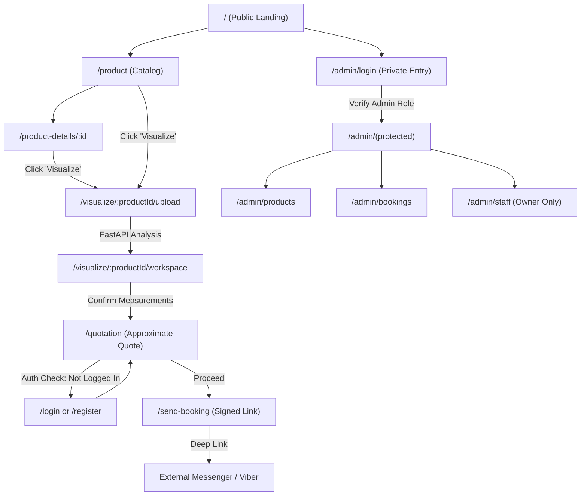

# Product Requirements Document (PRD)

**Project:** GlassFit (Web-Based Client-Space Visualization System for Customized Glass & Aluminum)  
**Date:** September 9, 2026  
**Version:** 1.0 (Capstone Production Release)  
**Owner:** Reynard John B. Rabanal (Lead Product / Systems Architect) & GlassFit Capstone Team (PUP CCIS)  
**Status:** Locked  
**Last reconciled:** September 9, 2026 (Reconciled with 16-table Supabase schema, Next.js 16 frontend, and FastAPI CV backend)  
**BRD:** N/A (Capstone Specification & PUP CCIS Manuscript Chapters 1-3)

---

## 1. Product Purpose & Value Proposition

GlassFit is a responsive, web-based photo-simulation and consultation-support platform specifically designed for customized glass and aluminum products (such as sliding windows, awning windows, glass doors, interior partitions, shower enclosures, and modular cabinets). Small and medium-sized enterprises (SMEs) in the glass and aluminum sector struggle with a persistent "visualization gap" during initial consultations: relying on static 2D brochures, hand sketches, sample photos, and verbal explanations across social media channels (Facebook Messenger and Viber) leaves prospective clients unable to perceive real-world spatial fit, scale, depth, and material appearance. This leads to prolonged uncertainty, repeated design revisions, delayed project approvals, and costly on-site material waste. 

GlassFit bridges this gap through an accessible, asynchronous **"Photo-Based Simulation"** workflow. Rather than imposing the prohibitive hardware requirements, thermal throttling, and tracking drift of continuous real-time Augmented Reality (AR), GlassFit allows clients to upload a single standard photo of their actual interior space, interactively position and configure parametric 3D models of glass and aluminum fixtures, apply automated environmental realism (ambient light matching, contact shadows, glass view modes, and object-aware foreground occlusion), and receive an instant approximate quotation before seamlessly handing off the confirmed visual reference to the business via Messenger or Viber.

---

## 2. Target Personas

### Primary Persona: Residential Homeowner & Commercial Client ("The Visualizer")

- **Who they are:** Property owners, residential remodelers, condominium dwellers, and commercial tenant managers (aged 25 to 55) who are planning to install or replace customized windows, doors, kitchen cabinets, or glass partitions. They primarily use mid-tier smartphones or personal laptops.
- **Their core frustration:** Inability to mentally project how a customized fixture (e.g., a dark-bronze 3-panel sliding window or a frosted-glass partition) will look and fit inside their specific room opening. They feel overwhelmed by technical aluminum profiles and fear committing a down payment to something that ends up clashing with their interior wall, furniture, or existing window opening.
- **What success looks like for them:** Uploading a photo of their space on their mobile browser, seeing a realistic 3D representation of the customized product fitted cleanly onto their wall/opening in under two minutes, knowing the approximate budgetary cost immediately, and having a definitive visual reference ready to send directly to the fabricator.

### Secondary Persona: Glass & Aluminum Fabricator & Business Staff ("The Estimator")

- **Who they are:** Shop owners, project coordinators, and administrative estimators running local glass and aluminum fabrication businesses (e.g., SME fabricators operating with 5 to 10 staff members across fabrication, estimation, and site installation).
- **Their core frustration:** Spending hours answering repetitive initial inquiries on Facebook/Messenger, manually drawing crude sketches, repeatedly modifying estimates because the customer changes their mind about dimensions or finishes, and traveling to physical site inspections only to find the customer had unrealistic expectations about the installation.
- **What success looks like for them:** Receiving an inquiry that includes a signed GlassFit consultation link containing a finalized composite photo of the client's space, the exact product template chosen, selected material variations (frame color, glass type), and confirmed preliminary measurements, cutting preliminary clarification time by over 50%.

---

## 3. Core Features & Priorities

| ID | Feature | Description | Priority |
|---|---|---|---|
| **PRD-F1** | Public Product Catalog & 2D Inspection | Responsive, public catalog to browse glass and aluminum products with category filters, detailed specs, and variation options without mandatory login. | Must-Have |
| **PRD-F2** | Interactive 3D Product Inspector | WebGL-based viewer on product detail pages enabling 360° orbit, rotation, and zoom of 3D preview assets on-demand from Cloudflare R2 without heavy catalog preloading. | Must-Have |
| **PRD-F3** | Space Photo Upload & Client Pre-Flight | Upload room photos from mobile camera or storage with client-side aspect-ratio, format, and dimension validation, providing an immediate preview canvas. | Must-Have |
| **PRD-F4** | Backend Computer Vision Image Analysis | FastAPI service analyzing uploaded space image for ambient luminance, color temperature, contrast, sharpness, and running YOLOv8 segmentation for foreground objects. | Must-Have |
| **PRD-F5** | Parametric 3D Assembly & Structural Guardrails | Data-driven structural generation where products (e.g., multi-pane windows) dynamically add, remove, or reposition components based on width thresholds, dead-load limits, and Behavior B hybrid confirmation modals. | Must-Have |
| **PRD-F6** | Photo-Based Visualization Workspace | Interactive canvas allowing movement, scaling, rotation, yaw/pitch perspective adjustments, and layer ordering with a single active Three.js overlay and cached layer composition. | Must-Have |
| **PRD-F7** | Environmental Realism & Glass Modes | Automated ambient lighting tinting, contact grounding shadows, edge softness blending, and glass appearance modes (Clear, Frosted, Opaque, Reflective, Outdoor View). | Must-Have |
| **PRD-F8** | Object-Aware Foreground Occlusion | Per-overlay toggle allowing product models to be visually layered behind detected foreground objects (e.g., couches, desks, pillars) using YOLOv8 segmentation masks. | Must-Have |
| **PRD-F9** | Canvas Compositing & Lean Snapshot Capture | Merging background photo, product overlays, shadows, and occlusion cutouts into a single flattened high-resolution image saved to Cloudflare R2 and Supabase `visualization_snapshots`. | Must-Have |
| **PRD-F10** | Quotation Measurement Modal & Parametric BOM Engine | Dedicated dimension confirmation modal allowing clients to verify real-world dimensions to compute decoupled 1D/2D/O(1) mathematical BOM pricing, scrap allowances, and frozen itemized estimates. | Must-Have |
| **PRD-F11** | Consultation PDF Reference Generation | Server-side generation of a downloadable consultation reference PDF containing the visual snapshot, itemized configuration breakdown, preliminary estimate, and disclaimer terms. | Must-Have |
| **PRD-F12** | Customer Authentication & Account Binding | Supabase Auth (Email/Password and Google OAuth) with Philippine mobile number validation (+63) required prior to finalizing snapshots, quotations, and booking links. | Must-Have |
| **PRD-F13** | Signed Booking Link & Messaging Handoff | Tamper-proof token-hashed consultation reference link (`signed_booking_links`) with one-click deep-link handoff to business Facebook Messenger or Viber. | Must-Have |
| **PRD-F14** | Role-Based Admin Portal & Part Inspector | Protected administrative back-office (`/admin`) for catalog management, 3D GLB uploads, split-screen Part Inspector component binding, and booking triage. | Must-Have |
| **PRD-F15** | Before-and-After Comparison Tool | Interactive slider allowing users to swipe between the original room photo and the simulated glass/aluminum installation. | Should-Have |
| **PRD-F16** | Multi-Product Overlay Management | Ability to place, duplicate, hide, delete, and individually manipulate multiple different product models (e.g., both a window and a cabinet) within one space image session. | Should-Have |
| **PRD-F17** | Customer Consultation History Dashboard | Authenticated user dashboard displaying historical consultation snapshots, quotation statuses, and booking request records. | Should-Have |
| **PRD-F18** | Guided Camera Capture & Perspective Helper | Visual on-screen guide overlay helping customers photograph walls straight-on with tilt warnings and vanishing-point alignment indicators. | Could-Have |
| **PRD-F19** | Central Raw Materials & Batch Pricing Editor | Administrative raw materials catalog (`/admin/materials`) managing regional aluminum profiles, glass stock rates, hardware piece costs, and scrap allowances. | Must-Have |
| **PRD-F20** | Continuous Real-Time AR Camera Tracking | Real-time SLAM/camera tracking in live browser feed. Explicitly excluded due to severe mobile device overheating, sensor drift, and poor low-end device compatibility. | Won't-Have (v1) |
| **PRD-F21** | In-App Payment Gateway & Checkout | In-app credit card / e-wallet processing. Cut because glass fabrication requires physical site measurement, contract signing, and formal down payment in person. | Won't-Have (v1) |
| **PRD-F22** | Native In-App Chat & Video Calling | Native messaging infrastructure. Cut in favor of deep-linking directly into Facebook Messenger and Viber where Philippine SMEs already operate. | Won't-Have (v1) |
| **PRD-F23** | Full ERP & Inventory Control System | Raw material inventory tracking, warehouse logistics, and employee payroll. Cut to keep system strictly focused on visualization and consultation support. | Won't-Have (v1) |
| **PRD-F24** | Persistent Editable 3D Scene Sessions | Storing full 3D transform matrices, segmentation masks, and camera states in the database. Cut to keep database lean; the flattened composite image is the permanent artifact. | Won't-Have (v1) |

---

## 4. User Stories & Acceptance Criteria

### US-01: Public Product Catalog Browsing (traces to PRD-F1)
> As a prospective customer, I want to browse the glass and aluminum product catalog and filter by fixture type without logging in so that I can explore design options freely.

**Acceptance Criteria:**
- Given an unauthenticated visitor on the website, when navigating to `/product`, then all active products (e.g., Windows, Doors, Cabinets, Partitions) are displayed with thumbnail images, descriptions, and "Price available upon configuration" notices (no ₱0.00 displays).
- Given the product catalog, when selecting a category filter tab (e.g., "Window"), then the catalog updates reactively without a full page reload, displaying only matching active products.

### US-02: Interactive 3D Product Inspection (traces to PRD-F2)
> As a customer viewing a product detail page, I want to toggle an interactive 3D model view so that I can inspect the frame profile, glass depth, and finish from any angle.

**Acceptance Criteria:**
- Given a product detail page (`/product-details/[id]`), when the page loads, then a high-resolution 2D catalog image is displayed by default to save mobile bandwidth.
- Given the 2D preview, when the customer clicks "View in 3D", then the WebGL canvas initializes, loads the GLB preview asset from Cloudflare R2, and enables OrbitControls (rotate, pitch, zoom) with a visible loading spinner during asset fetch.

### US-03: Space Photo Upload & Client Pre-Flight Validation (traces to PRD-F3)
> As a customer starting a visualization, I want to upload an image of my room opening so that I can use it as the canvas for fitting my chosen product.

**Acceptance Criteria:**
- Given the upload screen (`/visualize/[productId]/upload`), when a user selects or captures a photo, then the client validates that the file is an image (JPEG/PNG/WebP) and under 15MB.
- Given a valid image file, when uploaded, then the client immediately displays a local object URL preview and transmits the payload asynchronously to the FastAPI backend service.

### US-04: Automated Lighting & Scene Analysis (traces to PRD-F4)
> As a customer configuring a fixture in my room photo, I want the system to automatically analyze the image lighting so that the 3D model looks naturally integrated rather than pasted on.

**Acceptance Criteria:**
- Given an uploaded space image received by the FastAPI backend, when analyzed by the CV engine, then the service computes mean luminance, ambient color tint, contrast, sharpness, and estimated primary light direction in under 1,800ms.
- Given the analysis response, when the visualization workspace initializes, then Three.js directional and ambient lights are automatically calibrated to match the detected room luminance and color temperature.

### US-05: Parametric Product Assembly (traces to PRD-F5)
> As a customer customizing a window, I want the window's physical structure (number of panes and vertical mullions) to automatically adjust as I widen it so that it reflects real-world fabrication rules.

**Acceptance Criteria:**
- Given a parametric window fixture in the workspace, when the user drags the width parameter across the business structural threshold (e.g., width $\ge$ 2,400mm), then the model dynamically instantiates an additional vertical mullion component and a third glass pane based on `structural_rules`.
- Given a structural configuration change, then the component list is updated in memory so that the exact same structural assembly is passed to the quotation engine.

### US-06: Interactive Overlay Manipulation & Layering (traces to PRD-F6)
> As a customer in the visualization workspace, I want to move, scale, and rotate the product overlay over my wall opening so that I can check its visual fit.

**Acceptance Criteria:**
- Given an active product overlay in `/visualize/[productId]/workspace`, when the user drags on-screen handles or touches the overlay, then the model translates along the X/Y plane, scales proportionally, and rotates with smooth 60 FPS performance.
- Given a placed overlay, when the user clicks "Place", then the overlay is rendered to an off-screen canvas and cached as a transparent 2D bitmap layer, releasing active Three.js GPU overhead.

### US-07: Realism Adjustments & Glass View Simulation (traces to PRD-F7)
> As a customer visualizing a window or shower enclosure, I want to adjust shadow intensity and toggle different glass finishes so that I can see how clear versus frosted glass affects privacy.

**Acceptance Criteria:**
- Given a placed window overlay, when the user selects "Frosted Glass", then the material shader roughness increases to 0.85 with reduced transmission, obscuring the background behind the pane.
- Given any placed fixture, when the user adjusts the shadow slider, then a directional contact ground shadow updates opacity underneath the frame to anchor it against the floor/sill.

### US-08: Object-Aware Foreground Occlusion (traces to PRD-F8)
> As a customer placing a fixture behind a couch or desk in my photo, I want the product to slip behind the furniture so that the spatial depth looks genuine.

**Acceptance Criteria:**
- Given a space image where the FastAPI YOLOv8 model detected a foreground object (e.g., table, couch, pillar), when the user toggles "Layer Behind [Object]", then the corresponding binary segmentation mask is applied as a stencil overlay above the 3D layer.
- Given the stencil overlay applied, then pixels corresponding to the foreground furniture remain visible over the product frame without redrawing the entire scene.

### US-09: Final Canvas Compositing & Lean Snapshot (traces to PRD-F9)
> As a customer satisfied with my design, I want to generate a finalized visualization image so that I have a permanent record to share with the fabricator.

**Acceptance Criteria:**
- Given one or more placed overlays in the workspace, when the user clicks "Generate Final Output", then an HTML5 canvas composites the original photo, transparent overlay layers, glass effects, shadows, and occlusion cutouts into a single high-resolution WebP/PNG.
- Given the composited image, when uploaded to Cloudflare R2, then a new row is created in `public.visualization_snapshots` referencing `final_image_r2_key`, discarding temporary overlay transform coordinates and segmentation masks from the database.

### US-10: Quotation Measurement Confirmation Modal (traces to PRD-F10)
> As a customer proceeding from visualization to quotation, I want to verify or type in my exact tape-measured opening dimensions so that my price quotation is based on accurate dimensions without distorting my visual image.

**Acceptance Criteria:**
- Given a completed visualization, before quotation generation, when the system prompts the customer with the Dimension Confirmation Modal, then it displays the estimated visual dimensions and allows the user to either "Confirm Visual Dimensions" or "Enter Tape Measurements (Manual)".
- Given manual dimensions entered (e.g., 2,100mm $\times$ 1,500mm), when saved, then `product_configurations` stores `quotation_width = 2100`, `quotation_height = 1500`, and `measurement_source = 'Manual'` without altering or stretching the rendered snapshot image.

### US-11: Instant Approximate Quotation Generation (traces to PRD-F10)
> As a customer with confirmed measurements, I want to receive an itemized approximate quotation so that I know the estimated budget before talking to a sales agent.

**Acceptance Criteria:**
- Given confirmed configuration records, when the quotation engine runs, then it computes costs using product base price, variation add-ons (frame color, glass type), structural component quantities/linear lengths, and estimated labor.
- Given the calculated quote, then an immutable record is inserted into `quotation_estimates` and line items into `quotation_items`, accompanied by an explicit disclaimer: *"Approximate estimate only; subject to professional on-site validation and negotiation."*

### US-12: Consultation Reference PDF Generation (traces to PRD-F11)
> As a customer or estimator, I want to download a clean PDF summary containing the composite photo, dimensions, and itemized estimate so that I can store or print it.

**Acceptance Criteria:**
- Given a generated quotation, when the customer clicks "Download PDF Reference", then a server-side PDF generator embeds the finalized snapshot image, customer details, itemized breakdown, and terms, saving the document to R2 and storing `pdf_r2_object_key` in `quotation_estimates`.

### US-13: Customer Authentication & Registration (traces to PRD-F12)
> As a customer ready to save my consultation reference, I want to sign up or log in using email or Google so that my snapshot and quotation are securely tied to my account.

**Acceptance Criteria:**
- Given an unauthenticated user on `/quotation`, when clicking "Save & Book Consultation", then an auth modal prompts login or registration.
- Given registration, when entering a valid Philippine mobile number (+63 9XX XXX XXXX), matching passwords, and name, then a record is created in Supabase Auth and a linked row in `public.profiles` with `account_type = 'Customer'`.

### US-14: Signed Booking Link & Messaging Handoff (traces to PRD-F13)
> As an authenticated customer, I want to send my consultation reference directly to the fabricator via Messenger or Viber so that we can finalize measurements and scheduling.

**Acceptance Criteria:**
- Given an active quotation, when the user selects "Continue via Messenger" or "Continue via Viber", then a secure record in `signed_booking_links` is created with a cryptographic `token_hash` and a 14-day expiration timestamp, along with a `booking_requests` record with `status = 'Pending'`.
- Given the platform selected, then the browser opens the official business Messenger/Viber URL with a pre-filled message payload containing the unique signed reference link.

### US-15: Role-Based Admin Portal & Catalog Management (traces to PRD-F14)
> As a business owner or manager, I want to log into a dedicated administrative dashboard so that I can manage products, upload 3D models, and monitor customer booking requests.

**Acceptance Criteria:**
- Given navigation to `/admin/login`, when an authenticated user with `account_type = 'Admin'` and an active `admin_role_id` (Owner, Manager, Staff) logs in, then access is granted to `/admin/(protected)`. Customers attempting to access this route are redirected to `/login` with an unauthorized alert.
- Given an admin on `/admin/products`, when creating or updating a product, then the admin can upload 2D images and GLB models directly to Cloudflare R2 and update template parameters and component pricing.

---

## 5. App Flow & UX Intent

**Design reference:** Modern glassmorphism aesthetic, sleek neutral dark/light surfaces (Tailwind CSS v4 + shadcn/ui), high-contrast accessibility, and smooth micro-interactions via Motion (Framer Motion).

**UI Component & Style Consistency Mandate:** When touching the UI (adding new screens or modifying existing interfaces), developers and agents must strictly reuse the existing UI components and visual styles established in this repository (such as Tailwind CSS design tokens, shared components in `src/components/`, and existing feature layouts). Introducing alien component libraries, arbitrary ad-hoc styling, or unaligned design patterns is strictly prohibited.

### 5.1 Screen Inventory

| Screen | Purpose | Entry points | States to design |
|---|---|---|---|
| **Landing Page (`/`)** | Introduce value proposition, showcase interactive before/after teaser, and guide entry into catalog or visualization. | Direct URL, Root navigation | **Empty:** N/A (static content)<br>**Loading:** Skeleton hero and product teaser<br>**Error:** Error boundary with reload prompt<br>**Success:** Fully interactive hero, feature highlights, CTA buttons |
| **Product Catalog (`/product`)** | Search, filter, and browse glass and aluminum products with category badges and variation previews. | Main navigation, Hero CTA | **Empty:** "No products found for this category"<br>**Loading:** 8-card grid skeleton with pulse animation<br>**Error:** "Unable to load catalog. Please check connection."<br>**Success:** Responsive product grid with category pills |
| **Product Details (`/product-details/[id]`)** | Detailed product specifications, dimensions, available finishes, and 2D/3D inspection viewer. | Clicking a product card in `/product` | **Empty:** "Product not found"<br>**Loading:** Layout skeleton with spinner on 3D container<br>**Error:** Toast error if GLB fails to fetch<br>**Success:** Switchable 2D image / WebGL 3D orbit viewer with variation selector |
| **Photo Upload (`/visualize/[productId]/upload`)** | Pre-flight guidelines and upload drop-zone for customer space image. | "Visualize" button from Catalog or Product Details | **Empty:** Empty drag-and-drop zone with camera capture button<br>**Loading:** Progress indicator with image compression status<br>**Error:** "File exceeds 15MB" or "Invalid format" banner<br>**Success:** Instant thumbnail preview with "Proceed to Fitting" CTA |
| **Visualization Workspace (`/visualize/[productId]/workspace`)** | Core canvas to place, transform, layer, and adjust realism of product overlays over room photo. | Completion of photo upload | **Empty:** Blank photo background with overlay picker modal<br>**Loading:** Shimmer overlay while FastAPI analyzes lighting & segmentation<br>**Error:** Fallback notice: *"Automated lighting unavailable; manual controls active"*<br>**Success:** Full interactive canvas with transform gizmo, layer panel, and realism controls |
| **Dimension Confirmation Modal** | Verify visual dimensions versus tape measurements for quotation input. | Clicking "Finish & Quote" in workspace | **Empty:** Pre-populated with default visual dimensions<br>**Loading:** Calculating preliminary estimate spinner<br>**Error:** Inline validation: *"Please enter a valid positive number"*<br>**Success:** Two choice cards: "Keep Estimated" vs "Enter Exact Measurements" |
| **Quotation & Summary (`/quotation`)** | Display itemized cost breakdown, final composite snapshot, and PDF download action. | Workspace confirmation flow | **Empty:** "No active quote in session"<br>**Loading:** Itemized table skeleton with animated loader<br>**Error:** "Failed to calculate quotation. Try again."<br>**Success:** Card with composite image, price breakdown table, disclaimer, and CTA buttons |
| **Consultation Booking (`/send-booking`)** | Selection of consultation channel (Messenger / Viber) and generation of signed link. | "Book Consultation" from `/quotation` | **Empty:** Channel selector unselected<br>**Loading:** Generating secure cryptographic link spinner<br>**Error:** "Session expired. Please log in to generate link."<br>**Success:** Generated reference code, copyable link, and direct Messenger/Viber launcher |
| **Auth Pages (`/login`, `/register`)** | Customer authentication via Email/Password and Google OAuth with Philippine phone validation. | Navigation bar, Save & Quote prompt | **Empty:** Clean input fields with field guidelines<br>**Loading:** Disabled button with spinner on submit<br>**Error:** Specific alert banners: "Email already in use", "Invalid credentials"<br>**Success:** Instant redirect back to previous active step |
| **Customer Dashboard (`/dashboard`)** | Overview of user's saved visualization snapshots, quotation estimates, and booking statuses. | Profile menu in navigation | **Empty:** "You haven't saved any visualizations yet. [Explore Catalog]"<br>**Loading:** Skeleton card grid<br>**Error:** "Failed to load dashboard data"<br>**Success:** List of saved projects with status badges (Pending, Ongoing, Done) |
| **Admin Login (`/admin/login`)** | Isolated, non-public administrative authentication portal. | Direct URL navigation (`/admin/login`) | **Empty:** Email & password input fields<br>**Loading:** Authenticating credentials spinner<br>**Error:** "Access restricted to authorized administrators"<br>**Success:** Redirect to `/admin/products` |
| **Admin Portal (`/admin/(protected)/...`)** | Back-office management for products, 3D assets, structural rules, and booking requests. | Successful admin authentication | **Empty:** "No pending bookings / No products found"<br>**Loading:** Table skeleton loader<br>**Error:** Server action error toast<br>**Success:** Full CRUD data tables, modal forms for asset upload to R2 |

---

### 5.2 Navigation Model & Information Architecture

**Primary navigation pattern:**  
- **Customer Desktop:** Fixed top navigation header with Logo, Catalog, How It Works, Active Workspace shortcut, and User Profile / Login dropdown.  
- **Customer Mobile:** Sticky top header with brand mark + compact bottom navigation bar (Home, Catalog, Visualize, Dashboard).  
- **Admin Portal:** Persistent left sidebar with navigation to Overview, Product Catalog, Booking Requests, Staff Management, and Logout.

**Top-level destinations:**

| Destination | Nav label | Maps to screen (§5.1) | Route / path | Auth required | Feature(s) |
|---|---|---|---|---|---|
| Home | Home | Landing Page | `/` | No | Marketing, Discovery |
| Product Catalog | Products | Product Catalog | `/product` | No | PRD-F1, PRD-F2 |
| Product Details | View Product | Product Details | `/product-details/[id]` | No | PRD-F1, PRD-F2 |
| Space Upload | Visualize | Space Photo Upload | `/visualize/[productId]/upload` | No | PRD-F3, PRD-F4 |
| Workspace | Workspace | Visualization Workspace | `/visualize/[productId]/workspace` | No (Session) | PRD-F5, PRD-F6, PRD-F7, PRD-F8, PRD-F9 |
| Quotation | Quotation | Quotation Summary | `/quotation` | Yes (to save) | PRD-F10, PRD-F11 |
| Booking Handoff | Book Consultation | Consultation Booking | `/send-booking` | Yes | PRD-F12, PRD-F13 |
| Customer Portal | My Projects | Customer Dashboard | `/dashboard` | Yes (Customer) | PRD-F17 |
| Comparison | Compare | Before/After Comparison | `/comparison` | No (Session) | PRD-F15 |
| Admin Login | Admin Access | Admin Login | `/admin/login` | No | PRD-F14 |
| Admin Products | Products | Admin Catalog Management | `/admin/products` | Yes (Admin) | PRD-F14 |
| Admin Bookings | Bookings | Admin Consultation Requests | `/admin/bookings` | Yes (Admin) | PRD-F14 |
| Admin Staff | Staff | Admin Role Management | `/admin/staff` | Yes (Owner) | PRD-F14 |

**Information Architecture Hierarchy:**

- `/` (public landing)
  - `/product` (catalog listing)
    - `/product-details/[id]` (specifications and 3D preview)
  - `/visualize/[productId]`
    - `/upload` (photo upload and CV analysis trigger)
    - `/workspace` (interactive 3D placement and realism controls)
  - `/comparison` (before and after comparison view)
  - `/login` (customer login)
  - `/register` (customer registration)
  - `/quotation` (authenticated or session estimate review)
  - `/send-booking` (authenticated handoff to Messenger or Viber)
  - `/dashboard` (authenticated customer consultation history)
  - `/admin` (isolated administrative portal)
    - `/login` (admin credential authentication)
    - `/(protected)` (role-gated: Owner, Manager, Staff)
      - `/products` (product, variations, and R2 asset management)
      - `/materials` (raw materials and wholesale rate management)
      - `/bookings` (booking request review and status updates)
      - `/staff` (staff account provisioning - Owner only)




**Persistent / Global Elements:**  
- Universal Top App Bar with active product breadcrumb, quick auth avatar, and responsive menu.
- Non-obtrusive Cookie and Privacy banner compliant with the Philippine Data Privacy Act of 2012.
- In-workspace floating control dock containing Undo, Redo, Reset, Reset Lighting, and Finish buttons.

**Auth Boundaries:**  
- **Public Area:** Landing, Product Catalog, Product Details, Photo Upload, Visualization Workspace, and Before/After Comparison.  
- **Customer Authenticated Area:** Quotation saving, Signed Booking link generation, Consultation handoff, and Customer Dashboard (`/dashboard`).  
- **Admin Authenticated Area:** Entire `/admin/(protected)` tree, gated by Supabase JWT check + `profiles.account_type = 'Admin'` and active `admin_roles`.

**Deep-link / External Entry Points:**  
- `/share/:token`: Public read-only landing page displaying a verified consultation snapshot, chosen product specs, and quotation reference.  
- Direct product deep link: `/product-details/:id?action=visualize` navigating straight to upload.

---

### 5.3 App Flow

**Legend:** `[Screen]` = a screen · `[Decision]` = a branch · `((Exit))` = terminal/external handoff · `-->|condition|` = conditional path.

**Linear Primary Path:**  
`Landing Page → Product Catalog → Product Details (or direct Visualize) → Photo Upload & FastAPI Analysis → Visualization Workspace (Parametric Fit & Realism) → Dimension Confirmation Modal → Quotation Review → Customer Authentication → Signed Booking Reference → Messenger / Viber Consultation`

**Branching Flow Diagram:**

```mermaid
flowchart TD
    Start((Client Enters)) --> Browse[Browse Product Catalog]
    Browse --> Select[Select Product & View Details]
    Select --> 3DInspect{Toggle 3D View?}
    3DInspect -->|Yes| Orbit[Inspect 3D Preview Model]
    3DInspect -->|No| ClickViz[Click 'Visualize in My Space']
    Orbit --> ClickViz
    
    ClickViz --> Upload[Upload Room Photo]
    Upload --> ValidateImg{Image Valid?}
    ValidateImg -->|No: >15MB or invalid| UploadErr[Show Error Toast] --> Upload
    ValidateImg -->|Yes| FastAPICall[Send to FastAPI Backend]
    
    FastAPICall --> FastAPISuccess{Analysis OK?}
    FastAPISuccess -->|Success| ApplyAutoRealism[Extract Light, Color & YOLOv8 Masks]
    FastAPISuccess -->|Fail/Timeout| ApplyDefaults[Fallback to Neutral Lighting & Manual Layering]
    
    ApplyAutoRealism --> Workspace[Enter Visualization Workspace]
    ApplyDefaults --> Workspace
    
    Workspace --> Manipulate[Transform: Move, Scale, Rotate, Pitch]
    Manipulate --> GlassMode[Configure Glass View & Frame Variation]
    GlassMode --> Occlusion{Occlude Behind Object?}
    Occlusion -->|Yes| Stencil[Apply YOLOv8 Object Mask Stencil]
    Occlusion -->|No| Place[Place Overlay as Cached Layer]
    Stencil --> Place
    
    Place --> AddMore{Add Another Product?}
    AddMore -->|Yes| Workspace
    AddMore -->|No| Finish[Click 'Finish & Get Quote']
    
    Finish --> Composite[Canvas Compositing & Upload to R2]
    Composite --> DimModal[Dimension Confirmation Modal]
    DimModal --> EditDim{Keep Visual or Enter Exact?}
    EditDim -->|Enter Exact| ManualDim[Input Width/Height Measurements]
    EditDim -->|Keep Visual| ConfirmDim[Confirm Estimated Measurements]
    ManualDim --> GenQuote[Generate Approximate Quotation]
    ConfirmDim --> GenQuote
    
    GenQuote --> CheckAuth{Customer Logged In?}
    CheckAuth -->|No| PromptAuth[Sign Up / Login with PH Phone]
    PromptAuth --> SaveQuote[Persist Quotation & Snapshot in DB]
    CheckAuth -->|Yes| SaveQuote
    
    SaveQuote --> GenPDF[Generate Consultation PDF in R2]
    GenPDF --> SelectChannel[Select Messenger or Viber]
    SelectChannel --> SignLink[Generate Signed Booking Link with Token Hash]
    SignLink --> Handoff((Open Messenger / Viber with Pre-filled Payload))
```



**Flow Annotations:**

| Flow concern | Detail |
|---|---|
| **Entry points** | Customer enters from social media link, organic search, or direct marketing to `/` or `/product`. Admin enters exclusively through `/admin/login`. |
| **Decision branches** | 1. 2D image vs 3D preview on product page.<br>2. FastAPI lighting analysis success vs fallback to neutral studio preset.<br>3. Toggle object-aware occlusion mask vs standard layering.<br>4. Dimension modal: accept estimated visual dimensions vs input tape-measured millimeters.<br>5. Consultation handoff: Facebook Messenger vs Viber. |
| **Dead ends** | If FastAPI is completely offline, workspace degrades gracefully to manual overlay controls with neutral ambient lighting; the customer is never blocked from finishing their visualization. |
| **Abandonment / exit** | If a customer exits the workspace without finishing, temporary uploads in Cloudflare R2 (`temporary-visualizations/{session_id}/*`) expire automatically via R2 lifecycle rules after 24 hours. No orphaned records clutter Supabase. |
| **Edge cases** | 1. **Extreme room perspective:** Handled by yaw/pitch controls in the 3D viewport.<br>2. **Poor photo lighting (<20 mean lux):** Workspace displays a helper warning recommending a brighter photo or enabling workspace brightness boost.<br>3. **Window larger than photo:** Canvas bounds clip smoothly without breaking Three.js canvas buffer. |

---

### 5.4 Onboarding Flow

- **Aha / First-Value Moment:** The customer sees their selected 3D glass window or cabinet appear seamlessly over their real room photo with matched lighting and contact shadows in under 60 seconds.
- **Time-to-First-Value (TTFV) Target:** $\le 3\text{ minutes}$ from landing on the website to the first placed product overlay.
- **Skippable / Resumable:** No upfront registration is required to browse products, upload space photos, or interact in the workspace. Authentication is deferred until the customer chooses to save the quotation or request a consultation.
- **Friction Budget:** Initial upload requires 0 form fields. Final booking signup requires only First Name, Last Name, Valid Philippine Mobile Number (`+63`), Email, and Password.

---

### 5.5 UX Constraints

1. **Low-to-Mid Tier Mobile Hardware Optimization:** Modern Philippine consumers primarily browse on budget-to-midrange smartphones (e.g., MediaTek Helio, Snapdragon 6-series). The client app must never run continuous AR camera sessions or multiple active WebGL scenes simultaneously. Only **one live Three.js canvas overlay** is active during manipulation; placed overlays are cached as static 2D image layers.
2. **Bandwidth Efficiency:** 3D GLB preview models on the catalog are lazy-loaded only when the user explicitly clicks "View in 3D", keeping initial catalog page weight under 2.5MB.
3. **Responsive Breakpoints:** Fully fluid layouts tailored for 375px (mobile portrait), 768px (tablet portrait), and 1280px+ (desktop workstations).
4. **Touch & Precision Input:** On mobile devices, transform gizmos provide enlarged touch-target handles ($\ge 44\text{px}$) with numerical slider fallbacks for fine-tuning placement.

---

### 5.6 Instrumentation & Event Taxonomy

**Naming Convention:** `snake_case` using `[object]_[action]` format in past tense. No Personal Identifiable Information (PII) in property parameters.  
**Analytics Tool:** PostHog / Supabase Analytics event log.

| Event name | Fires when | Key properties | Feeds metric |
|---|---|---|---|
| `catalog_viewed` | User lands on `/product` | `category_filter`, `total_products_displayed` | Traffic & catalog engagement |
| `product_inspected_3d` | User clicks "View in 3D" | `product_id`, `product_type`, `model_strategy` | 3D inspection interest rate |
| `space_photo_uploaded` | Photo passes pre-flight checks | `file_size_kb`, `image_width`, `image_height` | Funnel conversion: Upload rate |
| `cv_analysis_completed` | FastAPI returns lighting & masks | `duration_ms`, `lux_detected`, `objects_count` | Backend CV latency & reliability |
| `overlay_placed` | User finalizes overlay placement | `product_id`, `layer_order`, `is_occluded` | Visualization engagement |
| `realism_adjusted` | User modifies light/shadow/glass | `setting_type`, `glass_mode`, `shadow_opacity` | Feature utilization |
| `snapshot_generated` | Final canvas composite completes | `duration_ms`, `overlays_count`, `r2_uploaded` | Core value milestone (Aha moment) |
| `dimensions_confirmed` | User completes dimension modal | `measurement_source` (Estimated/Manual), `unit` | Data accuracy & quotation readiness |
| `quotation_generated` | Quote is calculated and displayed | `quotation_id`, `total_amount`, `items_count` | Quotation completion rate |
| `consultation_handoff` | User clicks Messenger or Viber | `platform`, `quotation_id`, `has_pdf` | **Primary Business Conversion Metric** |

---

## 6. Out of Scope for This Release

The following features were discussed during product research and are explicitly cut from the v1 scope to avoid scope creep and preserve system performance:

1. **Continuous Real-Time Camera AR (SLAM tracking):** Deferred to v3.0. Real-time browser AR suffers from high thermal load, battery drain, and inaccurate scale drift on budget mobile devices.
2. **In-App Payment Gateway & Checkout (GCash, Maya, Cards):** Deferred to v2.0. Custom glass/aluminum fabrication requires physical on-site verification of plumbness, leveling, and structural framing before formal contracts and down payments are collected.
3. **In-App Direct Chat & Messaging Infrastructure:** Deferred indefinitely. Philippine SMEs and consumers overwhelmingly communicate through existing Facebook Messenger and Viber channels. Duplicating chat inside the web app adds friction.
4. **Full Enterprise Resource Planning (ERP), Inventory, & Fabrication Cut-List Optimization:** Explicitly excluded. GlassFit is strictly a customer-facing visualization and consultation platform, not an ERP or CNC cutting optimizer.
5. **Persistent Re-Editable 3D Workspace States in Database:** Cut by architectural design. The database stores the final flattened composite snapshot in Cloudflare R2, keeping database storage lean and transactions fast.

---

## 7. AI / Computer Vision Feature Specifications

**AI Component:** GlassFit Computer Vision Engine (`fastapi-service`)  
**Models Considered:** Mask R-CNN, SegFormer, YOLOv8s-seg, Depth Anything V2  
**Selected Model:** **YOLOv8s-seg** (`yolov8s-seg.pt`) paired with **Depth Anything V2** & statistical OpenCV luminance pipelines.  
*Reason:* YOLOv8s-seg offers the optimal balance of inference speed ($\approx 250\text{ms}$ on GPU, $<1,200\text{ms}$ on CPU) and boundary quality for everyday household furniture and structural elements, running reliably on affordable hosting instances.

### What the AI Does:
1. **Luminance & Color Temperature Analysis:** Computes average pixel intensity across grayscale channels and channel-wise RGB means to estimate room brightness (lux approximation) and warm/cool ambient color cast.
2. **Directional Light Estimation:** Identifies highlight clusters and gradient vectors across wall surfaces to approximate the primary light source angle.
3. **Object Segmentation & Masking:** Detects foreground occluding objects (e.g., tables, chairs, sofas, potted plants, architectural columns) and outputs binary transparency masks.

### Input $\rightarrow$ Output Contract:
- **Input:** Multipart form upload of the original space image (JPEG/PNG/WebP, max 15MB, resolution downscaled to max 1920px on the longest edge).
- **Output:** JSON response schema:
```json
{
  "status": "success",
  "workspace_image_url": "https://r2.glassfit.shop/temporary-visualizations/sess_123/workspace.webp",
  "dimensions": { "width": 1920, "height": 1080 },
  "lighting": {
    "mean_brightness": 142.5,
    "color_temperature": "warm",
    "ambient_tint": "#FFF8EE",
    "contrast": 1.15,
    "sharpness": 0.82,
    "suggested_light_angle_deg": 45
  },
  "detected_objects": [
    {
      "object_id": "obj_01",
      "class_name": "couch",
      "confidence": 0.89,
      "bounding_box": [120, 450, 600, 950],
      "mask_url": "https://r2.glassfit.shop/temporary-visualizations/sess_123/masks/obj_01.png"
    }
  ],
  "warnings": []
}
```
- **Latency Expectation:** $\le 1,800\text{ms}$ end-to-end response time under standard broadband.

### Human-in-the-Loop Points:
- The customer has full authority to override automated lighting using on-screen sliders (Brightness, Color Warmth, Shadow Strength).
- The customer selectively chooses whether an overlay should be layered behind a detected object via a simple toggle list ("Place behind Sofa").

### Fallback Behavior:
If the FastAPI service experiences a timeout or segmentation failure:
1. The frontend logs a warning and proceeds immediately into the workspace using default studio lighting (`#FFFFFF`, ambient intensity 1.0).
2. The object-aware occlusion toggle is disabled with an explanatory tooltip (*"Foreground detection unavailable for this photo; manual layer controls active"*).
3. The customer can complete their visualization without interruption.

### Token / Cost Budget:
- Self-hosted containerized FastAPI microservice running on an independent compute node. Zero third-party per-token API fees. Storage costs bounded by 24-hour Cloudflare R2 lifecycle deletion rules on temporary assets.

---

## 8. Dependencies & Assumptions

### Technical Dependencies:
1. **Next.js 16 (App Router) & React 19:** Frontend application runtime and SSR hydration.
2. **Supabase (PostgreSQL 15 + Supabase Auth + RLS):** User profiles, 16-table relational schema, security policies, and session tokens.
3. **Cloudflare R2 Object Storage:** S3-compatible, egress-free object storage for public catalog assets, 3D GLB models, final composite snapshots, and quotation PDFs.
4. **FastAPI (Python 3.10+):** CV microservice running PyTorch, OpenCV, NumPy, and Ultralytics YOLOv8.
5. **Three.js / React Three Fiber:** WebGL rendering engine for 3D model visualization and transform controls.

### Operational & Business Assumptions:
1. **Device Profile:** At least 70% of customer traffic will originate from mobile smartphone browsers (Chrome for Android and Safari for iOS).
2. **Network Infrastructure:** Target users have access to stable 4G/5G mobile data or home broadband (e.g., Converge, PLDT) capable of uploading a 5MB photo in under 3 seconds.
3. **Pricing Mechanism:** Unit costs for aluminum extrusions, glass panels per square meter, hardware sets, and fabrication labor are estimated guidelines configured by the business owner and are subject to physical site re-measurement.
4. **Partner SME Capacity:** The client business maintains active staff capable of monitoring incoming Messenger and Viber inquiries during standard business hours.

---

## 9. Implementation Plan

| # | Phase / Milestone | Entry criteria | Exit criteria (Definition of Done) | Deliverable | Depends on | Owner (DRI) | Top risk |
|---|---|---|---|---|---|---|---|
| **M1** | Planning & Requirements Locked | Manuscript Ch. 1-3 reviewed & analyzed | PRD locked, 16-table schema reconciled, scope boundaries signed off | Approved PRD (`docs/prd-glassfit.md`) | Initial chat context | Reynard Rabanal | Scope creep into full ERP or real-time AR |
| **M2** | Architecture & Asset Pipeline | PRD locked | Supabase migrations 001-004 applied, R2 asset buckets provisioned, FastAPI health-check green | Validated backend & Cloudflare R2 storage pipeline | M1 | Gabriel Pelagio | CORS & R2 presigned URL upload permissions |
| **M3** | Catalog, Auth & 3D Viewer | M2 completed | Public catalog live, Supabase SSR auth working, on-demand 3D orbit viewer rendering window GLB | Responsive Catalog & Product Detail module | M2 | Jedia Sagun | Heavy GLB models causing mobile browser tab crash |
| **M4** | Space Image & CV Analysis Pipeline | M3 completed | FastAPI returns lighting analysis & YOLOv8 masks $\le 1.8\text{s}$, client pre-flight operational | Integrated upload & CV analysis service | M3 | Gianne Dasco | High server memory during concurrent YOLOv8 inferences |
| **M5** | Workspace Visualization & Realism | M4 completed | Parametric window structural assembly, layer transforms, glass shaders, and object occlusion functioning | Interactive Photo-Based Visualization Workspace | M4 | Reynard Rabanal | Three.js touch gesture conflicts with browser scroll |
| **M6** | Quotation, PDF & Booking Handoff | M5 completed | Dimension confirmation modal, itemized quotation logic, PDF generation, and signed Messenger/Viber links | Complete End-to-End Consultation Flow | M5 | Gabriel Pelagio | Quotation pricing formula discrepancy with SME owner |
| **M7** | Protected Admin Portal | M6 completed | `/admin/login` gated by `profiles.admin_role_id`, CRUD interfaces for products, variations, rules, and bookings | Admin Management Dashboard | M6 | Jedia Sagun | Privilege escalation or leaking admin routes |
| **M8** | Quality Assurance & Pilot Testing | M7 completed | 0 P0/P1 bugs, ISO/IEC 25010 evaluation conducted with SME owner and 20 test users | QA Sign-off & Evaluation Report | M7 | All Team Members | Low user comprehension of manual dimension modal |
| **M9** | Production Deployment & Rollout | M8 signed off | Vercel production deployment green, FastAPI container deployed, Supabase production RLS locked | Live Production System (`glassfit.shop`) | M8 | Reynard Rabanal | Network latency between Vercel and local FastAPI host |

### Rollout Strategy:
- **Phased Rollout:**
  1. **Phase 1 (Alpha / Internal):** Capstone research group and PUP CCIS faculty advisors validate all 16 user stories in staging.
  2. **Phase 2 (Beta / Partner SME Pilot):** Deployment to the partner glass and aluminum business. The business owner, client coordinator, and 20 real inquiry clients use the system to generate consultation references.
  3. **Phase 3 (Public Production):** Full public release on production domain with monitoring enabled.
- *Reason:* A phased rollout allows calibration of the approximate quotation formula against real fabricated jobs before opening to general public traffic.

### Rollback Plan:
- **Trigger Criteria:** Any critical P0 defect (e.g., database connection saturation, photo upload failure rate $>5\%$, quotation calculation errors $>10\%$, or admin unauthorized data exposure).
- **Revert Mechanism:** Instant Git rollback to the previous tagged stable release on Vercel; database migrations are strictly backward-compatible (no destructive drops without dual-write phases); temporary session storage in R2 requires zero state cleanup.

---

## 10. Traceability Matrix (Requirements to Technical Components)

| PRD Feature ID | Module / Subsystem | Database Table(s) | Backend / Service | Primary Route(s) |
|---|---|---|---|---|
| **PRD-F1** | Catalog Listing | `products`, `product_assets`, `product_variations` | Supabase Client (Public Read) | `/product` |
| **PRD-F2** | 3D Inspector | `product_assets` (`Catalog 3D Preview`) | Cloudflare R2 / Three.js | `/product-details/[id]` |
| **PRD-F3** | Photo Pre-flight | N/A (Temporary Client State) | Next.js API / Browser File API | `/visualize/[productId]/upload` |
| **PRD-F4** | CV Scene Engine | N/A (Session Memory) | FastAPI (`main.py`, `yolov8s-seg.pt`) | `POST /analyze-space` |
| **PRD-F5** | Parametric Builder | `product_templates`, `product_parameters`, `product_components`, `structural_rules` | Three.js Structural Assembler | `/visualize/[productId]/workspace` |
| **PRD-F6** | Workspace Fitting | N/A (Active Client Canvas) | Canvas Compositor / Three.js | `/visualize/[productId]/workspace` |
| **PRD-F7** | Realism & Shaders | N/A (Active Client Canvas) | Custom Three.js Glass & Shadow Shaders | `/visualize/[productId]/workspace` |
| **PRD-F8** | Occlusion Stencil | N/A (Temporary R2 Masks) | HTML5 Canvas Stencil / FastAPI Mask | `/visualize/[productId]/workspace` |
| **PRD-F9** | Lean Snapshot | `visualization_snapshots` | Cloudflare R2 Upload API | `/visualize/[productId]/workspace` |
| **PRD-F10** | Dimension & Quote | `product_configurations`, `configuration_variations`, `quotation_estimates`, `quotation_items` | Quotation Service Engine | Modal / `/quotation` |
| **PRD-F11** | PDF Generator | `quotation_estimates.pdf_r2_object_key` | Serverless PDF Renderer / R2 | `/quotation` |
| **PRD-F12** | Auth & Identity | `profiles`, Supabase `auth.users` | Supabase SSR Auth | `/login`, `/register` |
| **PRD-F13** | Signed Handoff | `signed_booking_links`, `booking_requests` | Cryptographic Token Generator | `/send-booking` |
| **PRD-F14** | Admin Portal | `admin_roles`, all catalog & booking tables | Next.js Server Actions / Supabase RLS | `/admin/(protected)/*` |
| **PRD-F15** | Comparison View | `visualization_snapshots` | Client Side-by-Side Image Slider | `/comparison` |

---

## Self-Check & Verification

- [x] Every Must-Have feature in Section 3 has at least one user story in Section 4 with permanent PRD-F# tracking.
- [x] Acceptance criteria are rigorously testable using the standard Given/When/Then format.
- [x] Section 5.1 defines empty, loading, error, and success states for all interactive screens.
- [x] Section 5.2 defines routes, auth boundaries, navigation models, and an ASCII/Mermaid IA hierarchy matching the actual codebase.
- [x] Section 5.3 app flow includes annotated branches, fallbacks, dead-ends, and edge cases.
- [x] Section 5.6 defines an event taxonomy with triggers and properties for all key funnel actions.
- [x] Section 6 explicitly details out-of-scope features (real-time AR, in-app payments, native chat, ERP).
- [x] Section 7 details the computer vision engine (YOLOv8s-seg, OpenCV, latency targets, and fallback strategies).
- [x] Section 8 documents technical dependencies and operational business assumptions.
- [x] Section 9 details all milestones M1 through M9 through post-launch, including rollout and rollback plans.
- [x] Answers *what* to build and *why*, while leaving purely internal code mechanics to the SDD.
